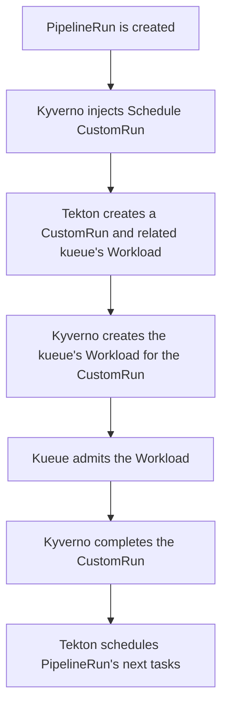
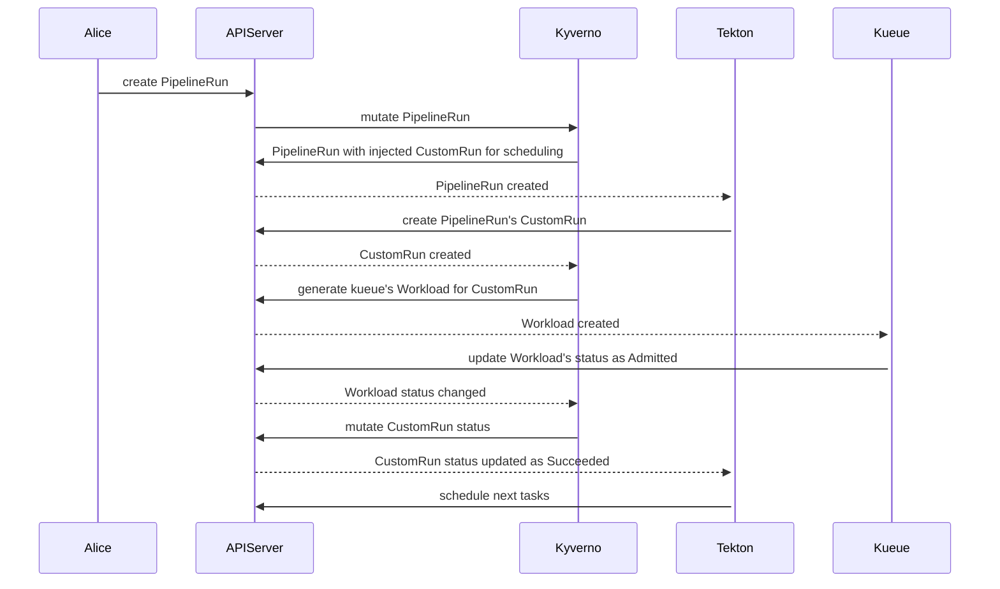

# Tekton Kueue

This repo contains some experiments that integrate Tekton's PipelineRuns with Kueue without relying on PipelineRun's `spec.status` field.

Kyverno is used to implement the workflow.

## Try it

Hopefully, you should just run the `demo.sh` script.

## Workflow

## Implementation details

* **PipelineRun is created**: [./tekton/pipelinerun.yaml](./tekton/pipelinerun.yaml)
* **Kyverno injects Schedule CustomRun**: [./kyverno/mutate-pipelinerun-clusterpolicy.yaml](./kyverno/mutate-pipelinerun-clusterpolicy.yaml)
* **Tekton creates a CustomRun**
* **Kyverno creates the kueue's Workload for the CustomRun**: [./kyverno/generate-workload-clusterpolicy.yaml](./kyverno/generate-workload-clusterpolicy.yaml)
* **Kueue admits the Workload**: [./kueue/](./kueue/)
* **Kyverno completes the CustomRun**: [./kyverno/mutate-customrun-workload.yaml](./kyverno/mutate-customrun-workload.yaml)
* **Tekton schedules PipelineRun's next tasks**
